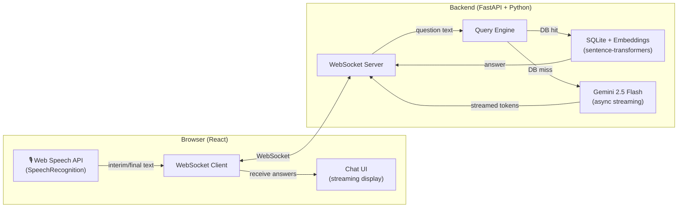

# AI Interview Assistant — Full Rebuild Implementation Plan

## Problem & Goal

Rebuild the existing Flask-based AI interview assistant prototype into a **production-grade, low-latency (<2 second) real-time interview coach** using a modern Python + React stack.

### Current Prototype Issues Identified

| Issue | Impact |
|:---|:---|
| **Flask + synchronous architecture** | Cannot handle concurrent WebSocket/SSE streams efficiently; blocks on ASR |
| **Local Whisper model for ASR** | ~1-3s transcription latency alone — eats the entire 2s budget before LLM even starts |
| **Batch audio processing** (record → stop → upload → transcribe) | Not real-time; user must click to stop, then wait for full pipeline |
| **Monolithic `index.html`** with inline JS/CSS | Not maintainable, not a real-world app structure |
| **No WebSocket support** | SSE is unidirectional; no real-time bidirectional communication |
| **API key hardcoded** in source | Security issue |
| **Old `google.generativeai` SDK** | Should use the newer `google-genai` SDK with `client.aio` for async streaming |

---

## Architecture Overview



### Key Latency Strategy: Eliminate the Biggest Bottleneck

The **#1 change** that makes sub-2-second responses achievable:

> **Replace server-side Whisper ASR with the browser's native Web Speech API (`SpeechRecognition`).**

| Metric | Old (Whisper on server) | New (Web Speech API) |
|:---|:---|:---|
| Audio capture → text | 1-3 seconds (record + upload + FFmpeg + Whisper) | **~200-400ms** (native browser engine, interim results in real-time) |
| Network overhead | Upload audio blob (100KB-1MB) | Send **text string** (~50 bytes) over WebSocket |
| Cost | CPU/GPU intensive | **Free** (built into Chrome) |

This alone saves **1-2.5 seconds** from the pipeline, leaving the full 2s budget for DB lookup + Gemini fallback.

> [!IMPORTANT]
> The Web Speech API works reliably in **Chrome/Edge** (which covers ~80% of desktop browsers). For a real-world interview assistant that the user controls their own browser, this is an excellent trade-off. The old Whisper-based approach is kept as a **fallback option** that can be enabled via config.

### Full Latency Budget

| Stage | Target | Technique |
|:---|:---|:---|
| Speech → Text | ~300ms | Web Speech API (browser-native, interim results) |
| Text → WebSocket → Server | ~50ms | Local WebSocket, minimal payload |
| DB Vector Search | ~20-50ms | Pre-loaded embeddings in memory, numpy cosine similarity |
| Gemini Fallback (if DB miss) | ~800-1500ms TTFT | `gemini-2.5-flash` async streaming, first token arrives fast |
| Server → WebSocket → Display | ~50ms | Direct WebSocket push, token-by-token streaming |
| **Total (DB hit)** | **~400-500ms** | ✅ Well under 2s |
| **Total (Gemini fallback, first token)** | **~1.2-1.8s** | ✅ Under 2s for first visible token |

---

## Tech Stack

| Layer | Technology | Rationale |
|:---|:---|:---|
| **Frontend** | React 18 + Vite | Modern SPA, component-based, hot reload |
| **Styling** | Vanilla CSS (custom design system) | Full control, premium dark UI |
| **Speech Recognition** | Web Speech API (`SpeechRecognition`) | Free, zero-latency, no server load |
| **Real-time Transport** | WebSocket (native) | Bidirectional, lowest latency |
| **Backend Framework** | FastAPI (async) | Native WebSocket + async support, production-grade |
| **LLM** | Gemini 2.5 Flash via `google-genai` SDK | Free tier, async streaming, fast TTFT |
| **Embedding Model** | `sentence-transformers/all-MiniLM-L6-v2` | Kept from prototype, fast & effective |
| **Vector DB** | SQLite + numpy (in-memory) | Kept from prototype, sub-50ms search |
| **Context Management** | Server-side session state (in-memory dict) | Maintains conversation history per session |

---

## Proposed Changes

### Project Folder Structure

```
ai-interview-demo/
├── backend/                     # Python FastAPI backend
│   ├── __init__.py
│   ├── main.py                  # FastAPI app entry point, WebSocket handler
│   ├── config.py                # All configuration & environment variables
│   ├── query_engine.py          # DB retrieval + Gemini fallback (async)
│   ├── prepare_db.py            # DB preparation script (updated paths)
│   ├── context_manager.py       # Conversation context/session management
│   └── requirements.txt         # Python dependencies
├── frontend/                    # React + Vite frontend
│   ├── index.html
│   ├── package.json
│   ├── vite.config.js
│   ├── public/
│   │   └── favicon.ico
│   └── src/
│       ├── main.jsx             # React entry point
│       ├── App.jsx              # Main app component
│       ├── App.css              # Global styles + design system
│       ├── hooks/
│       │   ├── useSpeechRecognition.js   # Web Speech API hook
│       │   └── useWebSocket.js           # WebSocket connection hook
│       └── components/
│           ├── Header.jsx       # App header with branding
│           ├── Header.css
│           ├── MicButton.jsx    # Mic button with pulse animation
│           ├── MicButton.css
│           ├── Waveform.jsx     # Audio waveform visualizer
│           ├── Waveform.css
│           ├── ChatPanel.jsx    # Chat message container
│           ├── ChatPanel.css
│           ├── MessageBubble.jsx # Individual message bubble
│           ├── MessageBubble.css
│           ├── StatusBar.jsx    # Connection/listening status
│           └── StatusBar.css
├── data/                        # QA database (kept from prototype)
│   ├── qa_pairs.csv
│   └── qa_embeddings.db
└── README.md
```

---

### Backend — FastAPI

#### [NEW] [config.py](file:///c:/Users/WORK/Documents/ai-interview-demo/backend/config.py)
- Centralized configuration using environment variables with `python-dotenv`
- Gemini API key from `.env` file (never hardcoded)
- Model names, similarity thresholds, token limits
- Database paths

#### [NEW] [main.py](file:///c:/Users/WORK/Documents/ai-interview-demo/backend/main.py)
- FastAPI application with CORS middleware
- **WebSocket endpoint** (`/ws`) — the core real-time channel:
  - Receives transcribed text from the browser (not audio!)
  - Performs DB vector search
  - If hit: sends answer immediately via WebSocket
  - If miss: streams Gemini tokens back via WebSocket in real-time
  - Maintains session context per connection
- Health check endpoint (`/health`)
- Static file serving for the built React frontend

#### [MODIFY] [query_engine.py](file:///c:/Users/WORK/Documents/ai-interview-demo/backend/query_engine.py)
- Rewritten to be **fully async** using `google-genai` SDK with `client.aio`
- `retrieve_answer()` — synchronous numpy vector search (fast enough, no async needed)
- `stream_gemini_answer()` — **async generator** yielding tokens from Gemini streaming
- Remove hardcoded API key
- Use `build_gemini_prompt()` with conversation context injection
- Proper error handling and retry logic

#### [NEW] [context_manager.py](file:///c:/Users/WORK/Documents/ai-interview-demo/backend/context_manager.py)
- `SessionContext` class storing last N Q&A pairs per WebSocket session
- Builds context string for Gemini prompt enrichment
- Auto-cleanup on WebSocket disconnect

#### [MODIFY] [prepare_db.py](file:///c:/Users/WORK/Documents/ai-interview-demo/backend/prepare_db.py)
- Update paths to work relative to project root
- Keep existing logic (it works well)

#### [NEW] [requirements.txt](file:///c:/Users/WORK/Documents/ai-interview-demo/backend/requirements.txt) (updated)
```
fastapi
uvicorn[standard]
websockets
google-genai
sentence-transformers
numpy
python-dotenv
```

---

### Frontend — React + Vite

#### [NEW] React application (`frontend/`)
- Created via `npx create-vite` with React template
- Premium dark UI with glassmorphism, aurora effects, and micro-animations (carried forward and enhanced from current design)

#### Key Components:

##### `useSpeechRecognition.js` — Custom React Hook
- Wraps the browser's `webkitSpeechRecognition` / `SpeechRecognition` API
- **Continuous mode** with `interimResults: true` for real-time text display
- Automatic end-of-speech detection (browser handles VAD)
- Returns: `{ transcript, interimTranscript, isListening, startListening, stopListening }`

##### `useWebSocket.js` — Custom React Hook
- Manages WebSocket connection to `ws://localhost:8000/ws`
- Auto-reconnect with exponential backoff
- Sends finalized transcripts to backend
- Receives streamed answer tokens and assembles them
- Returns: `{ sendMessage, lastMessage, isConnected }`

##### `ChatPanel.jsx` + `MessageBubble.jsx`
- Displays interviewer questions and AI responses in chat format
- AI responses stream in token-by-token with typing animation
- Visual distinction between DB answers (instant) and Gemini answers (streamed)

##### `Waveform.jsx`
- Real-time microphone audio visualization using `AnalyserNode`
- Reactive mic button glow based on audio amplitude

---

### Files to Remove

| File | Reason |
|:---|:---|
| [app.py](file:///c:/Users/WORK/Documents/ai-interview-demo/app.py) | Replaced by `backend/main.py` (FastAPI) |
| [templates/index.html](file:///c:/Users/WORK/Documents/ai-interview-demo/templates/index.html) | Replaced by React frontend |
| [backend/asr_adapter.py](file:///c:/Users/WORK/Documents/ai-interview-demo/backend/asr_adapter.py) | No longer needed — ASR moves to browser |
| [webrtc_signaling.py](file:///c:/Users/WORK/Documents/ai-interview-demo/webrtc_signaling.py) | WebRTC replaced by simpler WebSocket approach |
| Root [requirements.txt](file:///c:/Users/WORK/Documents/ai-interview-demo/requirements.txt) | Moved to `backend/requirements.txt` |

---

## WebSocket Message Protocol

### Client → Server
```json
{
  "type": "question",
  "text": "What is a deadlock in SQL?",
  "is_final": true
}
```

### Server → Client (DB Hit — instant)
```json
{
  "type": "answer_start",
  "source": "database",
  "matched_question": "What is a deadlock?",
  "similarity": 0.89
}
```
```json
{
  "type": "answer_chunk",
  "text": "A deadlock occurs when two transactions..."
}
```
```json
{
  "type": "answer_done"
}
```

### Server → Client (Gemini Streaming)
```json
{ "type": "answer_start", "source": "gemini" }
{ "type": "answer_chunk", "text": "A " }
{ "type": "answer_chunk", "text": "deadlock " }
{ "type": "answer_chunk", "text": "is " }
...
{ "type": "answer_done" }
```

---

## Open Questions

> [!IMPORTANT]
> **Gemini API Key**: You have an API key hardcoded in the current code. I'll move it to a `.env` file. Do you want me to use that same key, or do you have a different one to use?

> [!IMPORTANT]  
> **Browser Compatibility**: The Web Speech API works best in Chrome/Edge. Are you primarily using Chrome for this application? If cross-browser support is critical, we can add a Whisper fallback mode.

> [!IMPORTANT]
> **QA Database**: The current `qa_pairs.csv` has 40 entries. Do you plan to expand this? The current architecture handles thousands of entries efficiently, but if you're planning 100K+ entries, we'd want to consider FAISS or a dedicated vector DB.

---

## Verification Plan

### Automated Tests
```bash
# Backend health check
curl http://localhost:8000/health

# WebSocket connectivity test
python -c "import asyncio, websockets; asyncio.run(websockets.connect('ws://localhost:8000/ws'))"
```

### Manual Verification
1. Start backend: `cd backend && uvicorn main:app --reload --port 8000`
2. Start frontend: `cd frontend && npm run dev`
3. Open Chrome → speak a question → verify:
   - Real-time transcript appears as you speak
   - Answer appears within 2 seconds of finishing speech
   - DB hits return instantly (~400ms)
   - Gemini fallback streams first token within ~1.5s
4. Test conversation context (ask a follow-up referencing earlier answer)
5. Test edge cases: silence, very long questions, rapid questions
